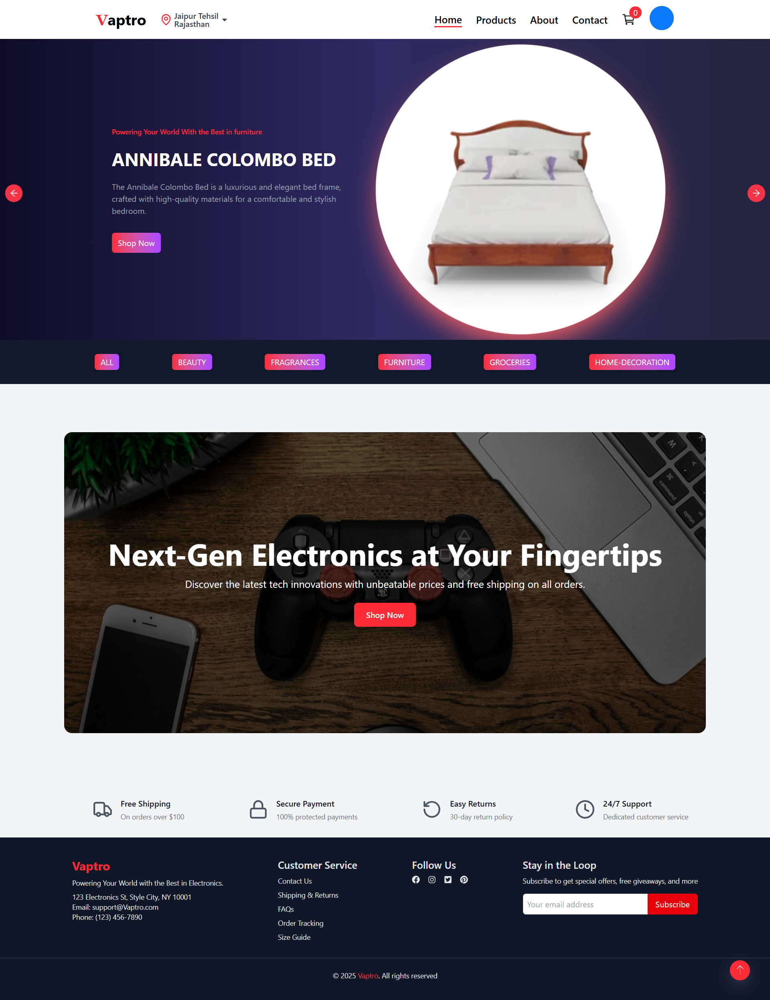
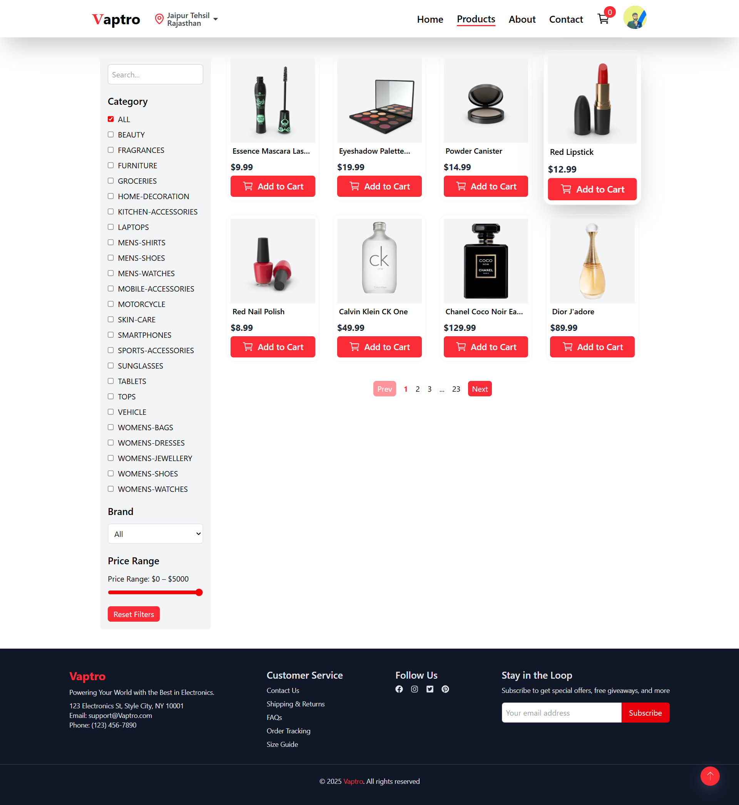
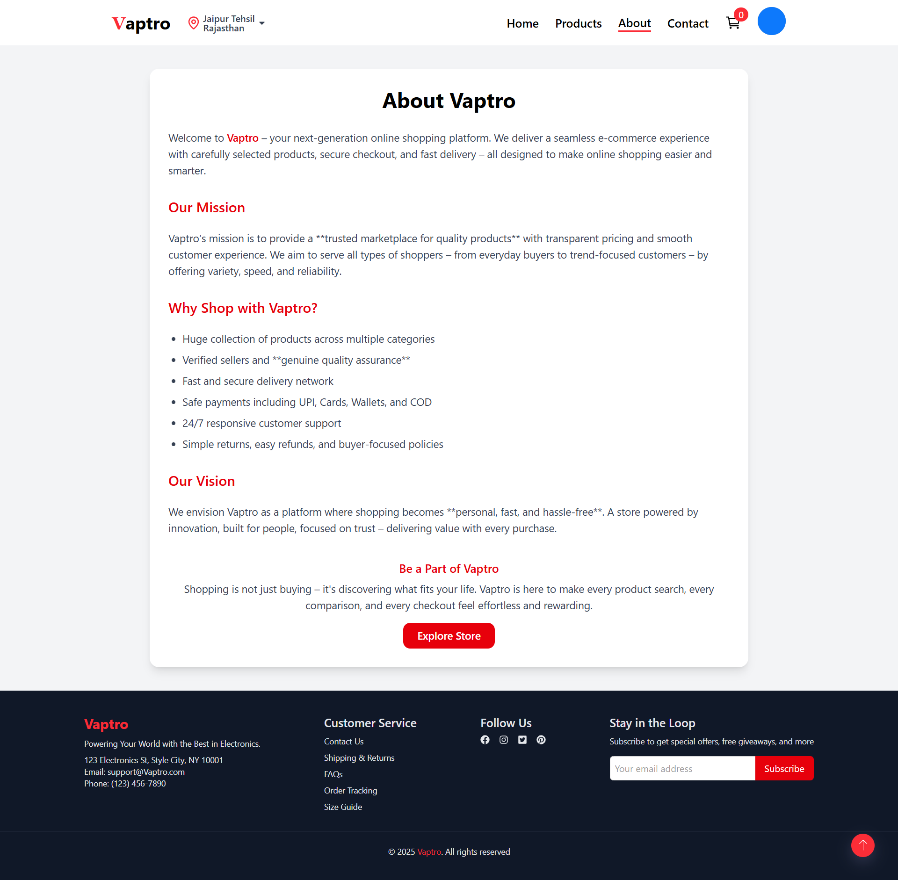
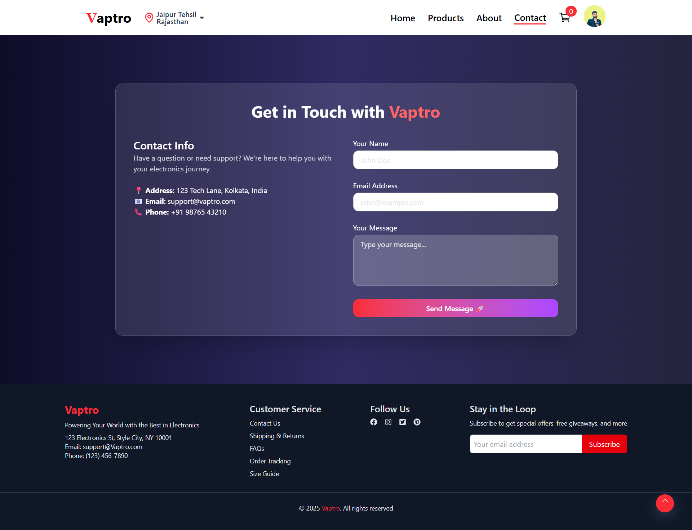
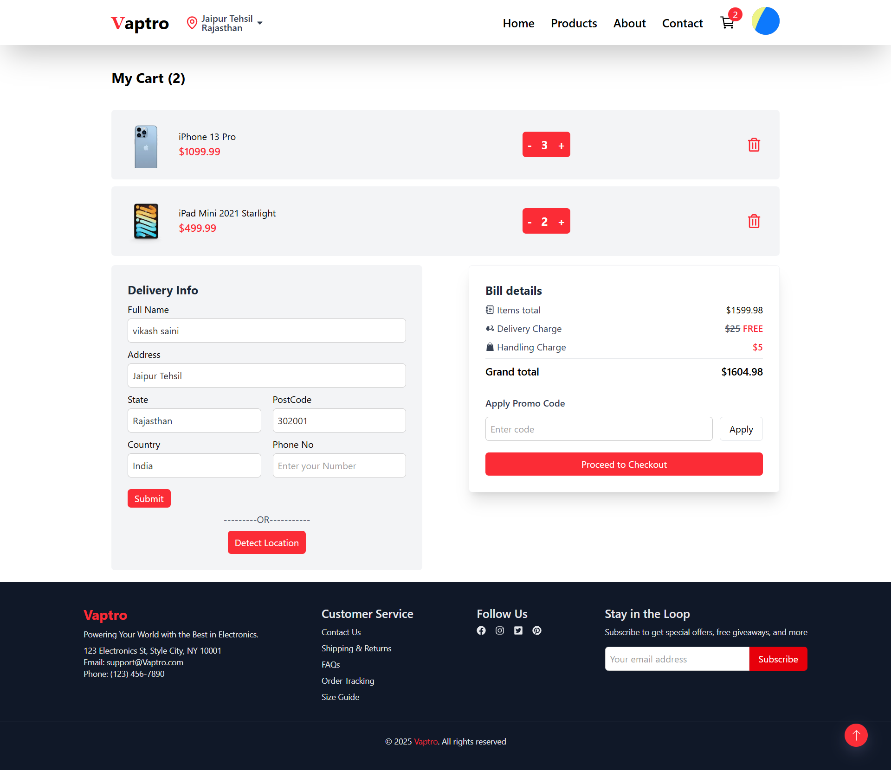
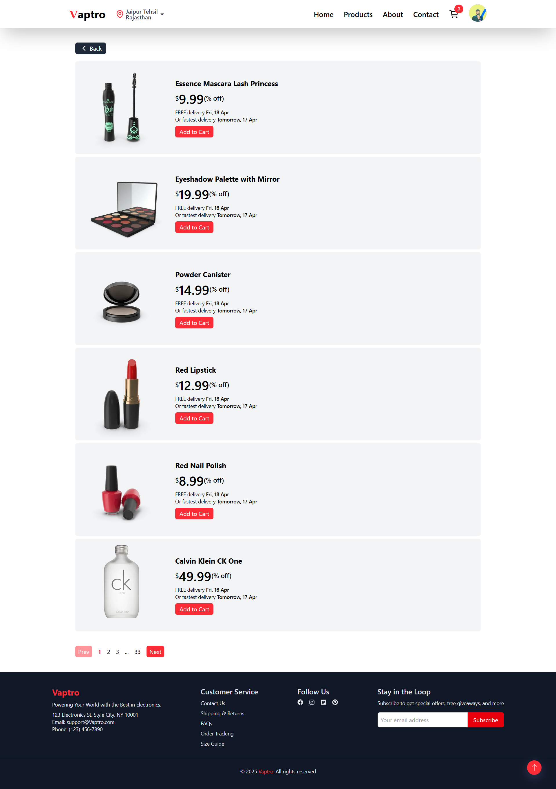

# README for Vaptro

## Project Title

`Vaptro`
*A short one-line tagline from the site — e.g. "Frontend developer portfolio" or similar.*

## Description

A concise description of the website and its purpose. Example:

> Vaptro is a personal portfolio website showcasing projects, skills, blog posts, and contact information. It is built with modern frontend technologies and deployed on Netlify.

Replace the paragraph above with the site's exact description or "About" text.

## Live Demo

* **URL:** [https://vaptro.netlify.app/](https://vaptro.netlify.app/)

## Table of contents

* [Features](#features)
* [Screenshots](#screenshots)
* [Tech Stack](#tech-stack)
* [Installation](#installation)
* [Usage](#usage)
* [Folder Structure](#folder-structure)
* [Deployment](#deployment)
* [Contributing](#contributing)
* [Credits](#credits)
* [License](#license)
* [Contact](#contact)

## Features

List of features visible on the site. Replace or expand with actual site items:

* Hero / Intro section with name and role
* Projects / Portfolio gallery with descriptions and links
* Skills / Tech stack section
* Blog or Posts (if present)
* Contact form or links (email / social links)
* Responsive layout
* Smooth animations / interactions

## Screenshots


*Home Page


*Product Page


*About Page


*Contact Page


*Cart Page


*Category View


*Single Product Page


## Tech Stack

* React 19
* Vite 7
* JavaScript  
* Tailwind CSS 4
* Clerk Authentication
* Axios / Axios API (via axios)
* Axios HTTP (via axios)
* Lottie Animations (lottie-react)
* Icons (lucide-react, react-icons, react-icons)
* Routing (react-router-dom 7)
* UI: react-slick + slick-carousel
* Toast notifications (react-toastify)
* Deployed on Netlify

## Installation (local development)

> These are general instructions — update to match the project's actual package manager and scripts.

1. Clone the repo

```bash
git clone https://github.com/mvikashsaini/Vaptro-Ecommercre-Frontend.git
cd <repo-name>
```

2. Install dependencies

```bash
npm install
# or
pnpm install
# or
yarn
```

3. Start the dev server

```bash
npm run dev
# or
npm start
```

## Usage

Open `http://http://localhost:5173/` (or the port shown by the dev server) to view the site locally. Edit source files in the `src/` folder and the dev server will hot-reload.

├── public/
├── src/
│   ├── components/
│   ├── pages/ (or routes/)
│   ├── styles/
│   └── assets/
├── package.json
└── netlify.toml

```


## Deployment

This site is deployed on Netlify. Example automated deploy steps:

1. Connect the GitHub repo to Netlify.
2. Set build command (e.g. `npm run build`) and publish directory (e.g. `dist` or `build`).
3. Deploy — Netlify will create a live URL.


